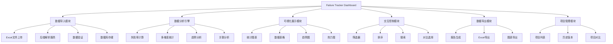
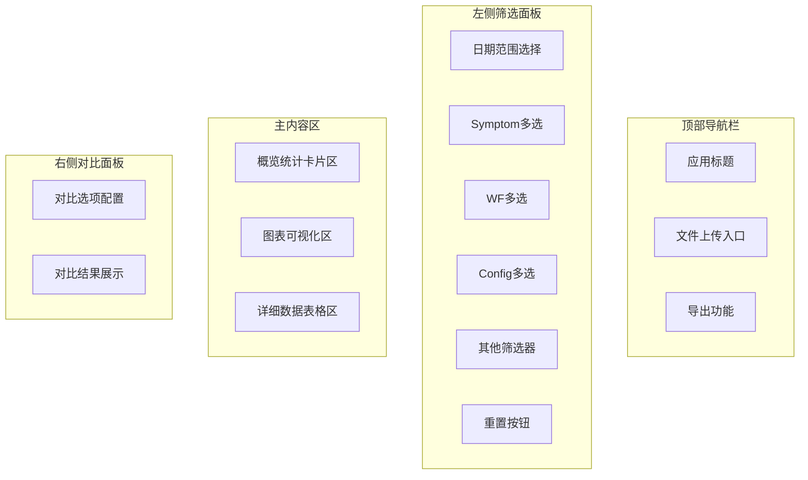
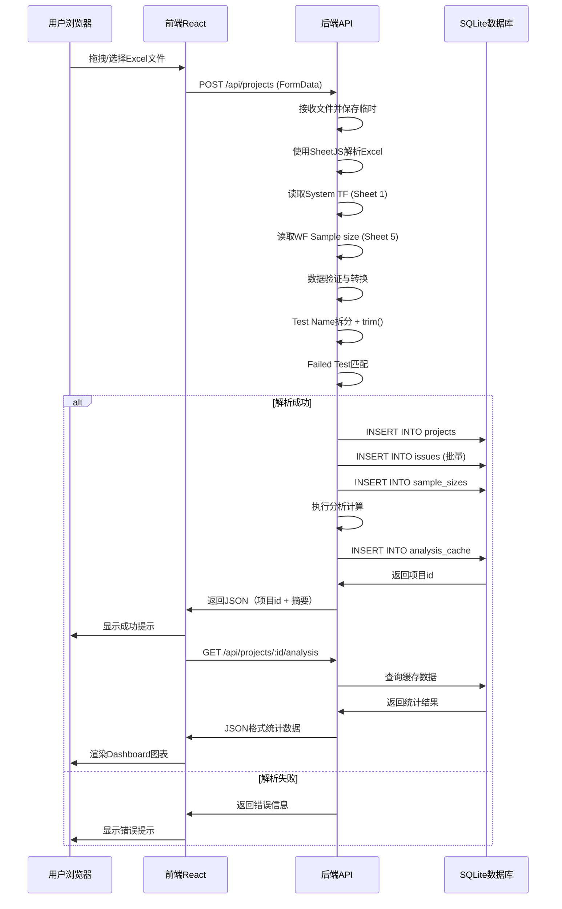
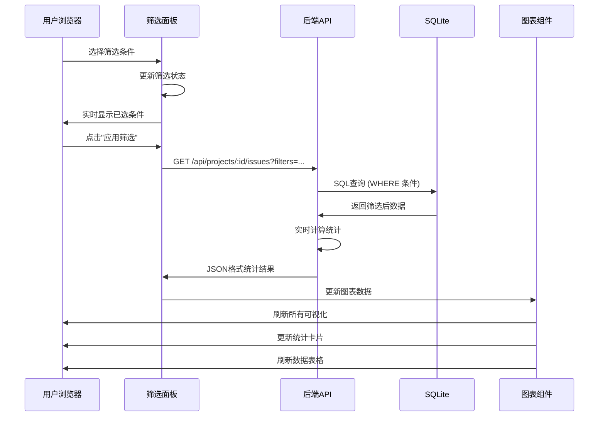
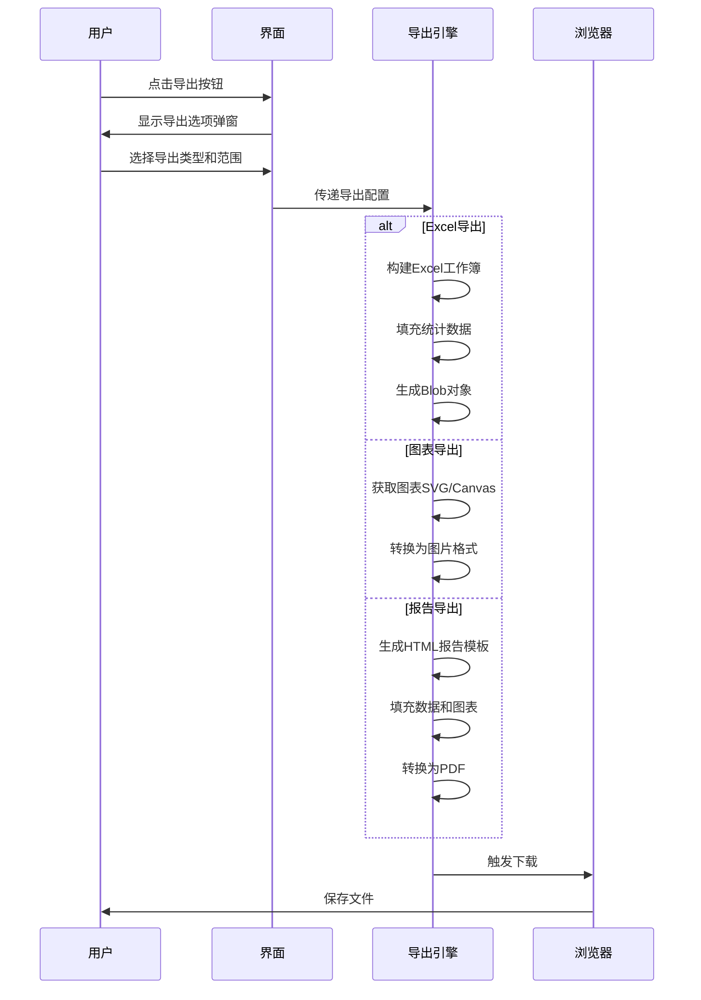
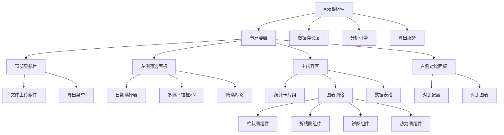
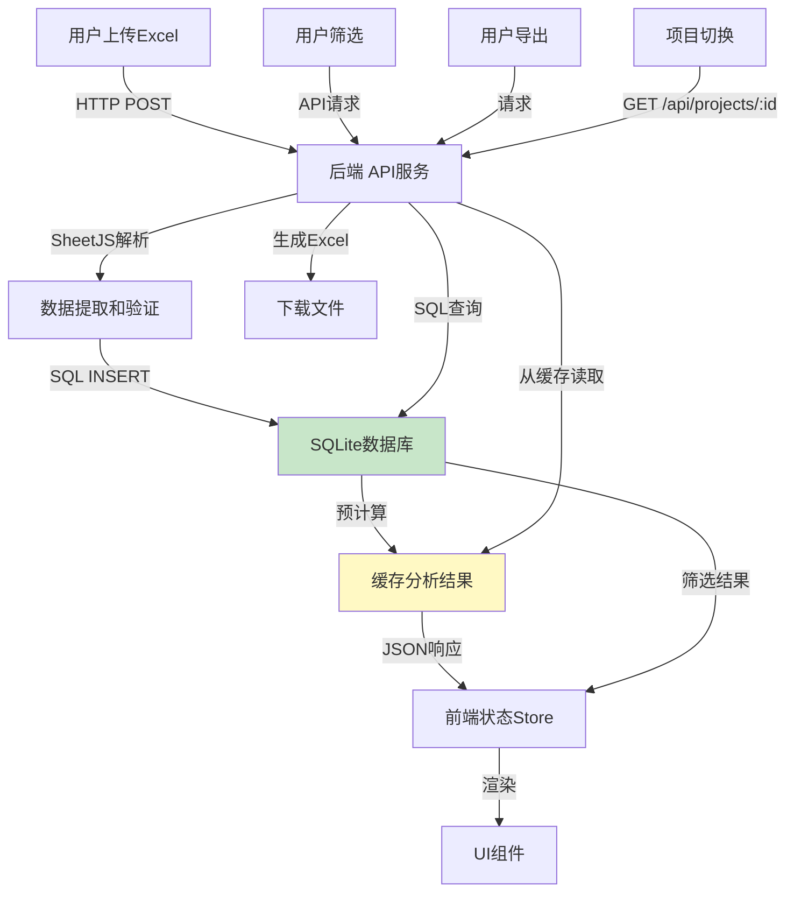
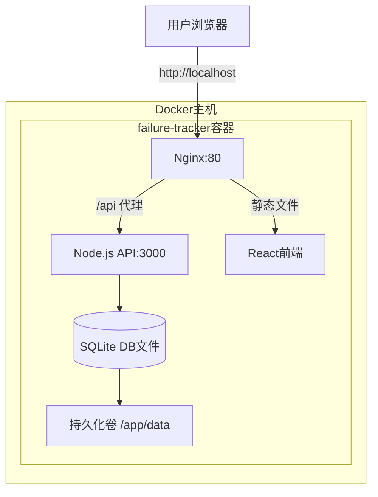

# Failure Tracker Dashboard 设计文档

## 1. 系统概述

### 1.1 目标
构建一个基于Web的Failure Tracker Dashboard，用于分析和统计M60 P1 REL FA Tracker中的Failure数据，支持数据持久化存储、多维度分析、数据可视化、筛选和导出功能。

### 1.2 核心价值
- 自动化分析Failure Symptom与WF、Config等维度的失败率
- 数据库持久化存储，支持历史项目管理和版本对比
- 提供交互式数据探索和可视化能力
- 支持高级筛选、对比分析和数据导出
- 多用户共享数据，提升团队协作效率
- 提升问题分析效率和决策支持

### 1.3 部署模式
Docker容器化部署，支持本地或局域网访问

### 1.4 技术架构
- **前端**：React单页应用
- **后端**：Node.js RESTful API
- **数据库**：SQLite（轻量级、零配置）
- **部署**：Docker单容器All-in-One方案

## 2. 功能架构

### 2.1 功能模块划分



### 2.2 功能清单

| 模块 | 功能 | 优先级 | 说明 |
|------|------|--------|------|
| **项目管理** | **项目列表** | **P0** | **显示所有历史上传项目** |
| **项目管理** | **项目切换** | **P0** | **切换查看不同项目数据** |
| **项目管理** | **项目删除** | **P1** | **删除历史项目** |
| 数据导入 | Excel文件上传 | P0 | 支持拖拽或选择文件 |
| 数据导入 | 自动数据解析 | P0 | 识别表头和数据行 |
| **数据导入** | **数据库存储** | **P0** | **解析后存入SQLite数据库** |
| 数据导入 | 数据预览 | P1 | 显示解析后的数据摘要 |
| 统计分析 | Failure Symptom统计 | P0 | 按症状分类统计 |
| 统计分析 | WF维度失败率 | P0 | 计算各WF的失败率 |
| 统计分析 | Config维度失败率 | P0 | 计算各配置的失败率 |
| 统计分析 | 交叉分析 | P1 | Symptom × WF × Config多维分析 |
| 可视化 | 失败率柱状图 | P0 | 对比不同维度失败率 |
| 可视化 | 分布饼图 | P1 | 显示占比分布 |
| 可视化 | 趋势折线图 | P1 | 时间序列趋势 |
| 可视化 | 热力图 | P1 | 症状-配置关联热力图 |
| 可视化 | 详细数据表格 | P0 | 支持排序和分页 |
| 筛选控制 | 日期范围筛选 | P1 | 选择时间段 |
| 筛选控制 | Symptom筛选 | P0 | 多选症状类型 |
| 筛选控制 | WF筛选 | P0 | 多选工作流 |
| 筛选控制 | Config筛选 | P0 | 多选配置 |
| 筛选控制 | 严重程度筛选 | P1 | 按严重级别过滤 |
| 筛选控制 | 组合筛选 | P1 | 多条件联合筛选 |
| 筛选控制 | 快速搜索 | P1 | 关键词搜索 |
| 对比分析 | 维度对比 | P1 | 选择2-3个维度对比 |
| 对比分析 | 时间段对比 | P2 | 不同时期数据对比 |
| 导出功能 | 分析结果导出Excel | P0 | 导出统计表格 |
| 导出功能 | 图表导出为图片 | P1 | PNG/SVG格式 |
| 导出功能 | 生成分析报告 | P2 | PDF格式完整报告 |

## 3. 数据模型

### 3.1 Excel文件结构说明

**文件来源**：M60 P1 REL FA Tracker 20251103.xlsx

**解析位置**：后端服务器（不在浏览器中解析）

#### 3.1.1 Sheet 1: System TF（问题列表）

**关键信息**：
- 表头位置：第7行
- 数据起始行：第8行
- 每行代表一个Failure Issue

**实际字段结构**（共30个字段）：

| 序号 | 字段名 | 数据类型 | 说明 | 分析用途 |
|-----|--------|---------|------|----------|
| 1 | FA# | 字符串 | Failure Analysis编号 | 唯一标识 |
| 2 | Open Date | 日期 | 开启日期 | 时间趋势分析 |
| 3 | Priority | 字符串 | 优先级 | 严重程度筛选 |
| 4 | Master Radar# | 字符串 | 主Radar编号 | 问题关联 |
| 5 | Sub Radar# | 字符串 | 子Radar编号 | 问题关联 |
| 6 | Jabil FA DRI | 字符串 | 责任人 | 责任人筛选 |
| 7 | Sample Status | 字符串 | 样本状态 | 状态筛选 |
| 8 | Department | 字符串 | 部门 | 部门维度分析 |
| 9 | Unit# | 字符串 | 单元编号 | 设备追踪 |
| 10 | SN | 字符串 | 序列号 | 设备追踪 |
| 11 | **WF** | 字符串 | **工作流编号** | **关键维度** |
| 12 | **Config** | 字符串 | **配置名称** | **关键维度** |
| 13 | Test History | 文本 | 测试历史 | 详细信息 |
| 14 | Failed Test | 字符串 | 失败测试项 | 测试项分析 |
| 15 | Failed Cycle Count | 数值 | 失败循环次数 | 统计分析 |
| 16 | Failure Type | 字符串 | 失败类型(Spec./Strife) | 类型分类 |
| 17 | Function or Cosmetic | 字符串 | 功能或外观 | 分类筛选 |
| 18 | Failed Location | 字符串 | 失败位置 | 位置分析 |
| 19 | **Failure Symptom / Failure Message** | 字符串 | **失败症状/消息** | **关键维度** |
| 20 | FA Status | 字符串 | FA状态 | 状态筛选 |
| 21 | Follow Up Actions | 文本 | 后续行动 | 详细信息 |
| 22 | **Root Cause** | 文本 | **根本原因** | **根因分析** |
| 23 | Multiple Component failureMode (Y/N) | 字符串 | 是否多组件失败 | 复杂度标记 |

#### 3.1.2 Sheet 5: WF Sample size（样本量信息）

**数据结构**：

| 列位置 | 字段说明 | 数据类型 | 说明 |
|-------|--------|---------|------|
| 第1列 | WaterFall | 字符串 | WF工作流编号，与System TF中的WF字段对应 |
| 第2列 | Test Name | 字符串 | 所有测试项合并，每个测试用+号连接 |
| 第3列及之后 | **动态Config列** | 数值 | **每一列的列头为Config名称，值为该Config的Sample Size** |

**Config列动态识别规则**：
- 表头第1行，从第3列开始的所有列头即为Config名称
- Config数量不固定，根据实际表头列数动态识别
- 系统自动提取并存储所有Config名称到数组

**当前数据示例（M60 P1 REL项目）**：
- 第3列：R1CASN
- 第4列：R2CBCN
- 第5列：R3CBCN
- 第6列：R4FNSN

**数据关联关系**：
- WaterFall字段（第1列）关联到System TF表的WF字段
- **Test Name包含该WF的所有测试项,用+号分隔**
  - 系统需要按+号拆分Test Name为独立的测试项数组
  - **拆分时必须去除每个测试项前后的空格（trim操作）**
  - **示例**：`"HS 65/90/72 + 18 Sided Drop 1m PB Sequence A"` 拆分为 `["HS 65/90/72", "18 Sided Drop 1m PB Sequence A"]`
  - 每个测试项编号为Test1, Test2, Test3, ...
  - System TF中的Failed Test字段应该对应Test Name中的某一个测试项（精确匹配，不含多余空格）
- 从第3列开始，列头为Config名称，单元格值为对应的Sample Size数值
- **Config名称列表在运行时动态生成，用于筛选器和统计分析**
- Sample Size用于计算准确的失败率（ppm）

### 3.2 解析后的标准化数据模型

#### 3.2.1 Issue数据模型（来自System TF）

**核心字段**（用于主要分析）：

| 字段名 | 数据类型 | 来源字段 | 说明 | 是否必需 |
|--------|---------|---------|------|----------|
| faNumber | 字符串 | FA# | FA编号，唯一标识 | 是 |
| openDate | 日期对象 | Open Date | 开启日期 | 是 |
| wf | 字符串 | WF | 工作流编号 | 是 |
| config | 字符串 | Config | 配置名称 | 是 |
| symptom | 字符串 | Failure Symptom / Failure Message | 失败症状 | 是 |
| priority | 字符串 | Priority | 优先级 | 否 |
| failureType | 字符串 | Failure Type | Spec./Strife | 否 |
| **failedTest** | **字符串** | **Failed Test** | **失败的测试项原始名称** | **否** |
| **testId** | **字符串** | **（计算得出）** | **匹配到的测试编号（Test1/Test2/Test3）** | **否** |
| failedLocation | 字符串 | Failed Location | 失败位置 | 否 |
| rootCause | 字符串 | Root Cause | 根本原因 | 否 |
| faStatus | 字符串 | FA Status | FA状态 | 否 |
| department | 字符串 | Department | 部门 | 否 |
| owner | 字符串 | Jabil FA DRI | 责任人 | 否 |
| sampleStatus | 字符串 | Sample Status | 样本状态 | 否 |
| functionOrCosmetic | 字符串 | Function or Cosmetic | 功能/外观 | 否 |
| multiComponent | 字符串 | Multiple Component failureMode (Y/N) | 多组件失败 | 否 |
| rawData | 对象 | 全部字段 | 原始行数据（保留所有字段） | 是 |

#### 3.2.2 Sample Size数据模型（来自WF Sample size）

| 字段名 | 数据类型 | 说明 |
|--------|---------|------|
| waterfall | 字符串 | WF工作流编号 |
| testName | 字符串 | 原始Test Name字符串 |
| **tests** | **对象数组** | **拆分后的测试项列表** |
| configSamples | 对象 | 动态Config及其Sample Size的键值对 |

**tests数组元素结构**：

| 字段名 | 数据类型 | 说明 |
|--------|---------|------|
| testId | 字符串 | 测试项编号（Test1, Test2, Test3, ...） |
| testName | 字符串 | 测试项名称（从Test Name拆分） |
| index | 数值 | 在Test Name中的位置索引（从0开始） |

**configSamples对象结构**：
- 键（key）：Config名称（从表头第3列开始动态提取）
- 值（value）：对应的Sample Size数值
- 动态结构，Config数量不固定

**示例数据（4个Config的情况）**：
```
{
  waterfall: "WF001",
  testName: "Test A + Test B + Test C",  // 原始数据可能包含+号前后的空格
  tests: [
    { testId: "Test1", testName: "Test A", index: 0 },  // 已去除前后空格
    { testId: "Test2", testName: "Test B", index: 1 },  // 已去除前后空格
    { testId: "Test3", testName: "Test C", index: 2 }   // 已去除前后空格
  ],
  configSamples: {
    "R1CASN": 100,
    "R2CBCN": 150,
    "R3CBCN": 200,
    "R4FNSN": 50
  }
}
```

**真实场景示例**：
```
{
  waterfall: "WF003",
  testName: "HS 65/90/72 + 18 Sided Drop 1m PB Sequence A",
  tests: [
    { testId: "Test1", testName: "HS 65/90/72", index: 0 },
    { testId: "Test2", testName: "18 Sided Drop 1m PB Sequence A", index: 1 }
  ],
  configSamples: {
    "R1CASN": 120,
    "R2CBCN": 180
  }
}
```

**示例数据（2个测试项）**：
```
{
  waterfall: "WF002",
  testName: "Test X+Test Y",
  tests: [
    { testId: "Test1", testName: "Test X", index: 0 },
    { testId: "Test2", testName: "Test Y", index: 1 }
  ],
  configSamples: {
    "ConfigA": 300,
    "ConfigB": 250,
    "ConfigC": 180
  }
}
```

### 3.3 分析结果数据模型

#### 3.3.1 Symptom维度统计

| 字段 | 类型 | 说明 |
|------|------|------|
| symptom | 字符串 | 症状名称 |
| totalCount | 整数 | 总出现次数 |
| failureRate | 浮点数 | 失败率（百分比） |
| affectedWFs | 数组 | 影响的WF列表 |
| affectedConfigs | 数组 | 影响的Config列表 |
| trendData | 数组 | 时间趋势数据点 |

#### 3.3.2 WF维度统计

| 字段 | 类型 | 说明 |
|------|------|------|
| wf | 字符串 | WF名称 |
| totalTests | 整数 | 总测试次数 |
| failureCount | 整数 | 失败次数 |
| failureRate | 浮点数 | 失败率 |
| topSymptoms | 数组 | 主要症状列表 |
| configBreakdown | 对象 | 按配置分解的统计 |

#### 3.3.3 Config维度统计

| 字段 | 类型 | 说明 |
|------|------|------|
| config | 字符串 | 配置名称 |
| totalTests | 整数 | 总测试次数 |
| failureCount | 整数 | 失败次数 |
| failureRate | 浮点数 | 失败率 |
| topSymptoms | 数组 | 主要症状列表 |
| wfBreakdown | 对象 | 按WF分解的统计 |

#### 3.3.4 测试项维度统计

| 字段 | 类型 | 说明 |
|------|------|------|
| wf | 字符串 | WF编号 |
| testId | 字符串 | 测试项编号（Test1/Test2/Test3） |
| testName | 字符串 | 测试项名称 |
| failureCount | 整数 | 该测试项的失败次数 |
| totalSamples | 整数 | 该测试项的总样本数（所有Config之和） |
| failureRate | 浮点数 | 失败率 (ppm) |
| topSymptoms | 数组 | 该测试项下主要症状 |
| configBreakdown | 对象 | 按Config分解的统计 |

**说明**：
- 每WF的每个测试项（Test1, Test2, Test3, ...）都有独立的统计
- 用于分析哪个测试项更容易失败
- 支持跨WF的同名测试项聚合分析

#### 3.3.5 交叉分析矩阵

| 字段 | 类型 | 说明 |
|------|------|------|
| symptom | 字符串 | 症状 |
| wf | 字符串 | WF |
| config | 字符串 | Config |
| count | 整数 | 出现次数 |
| percentage | 浮点数 | 占比 |

#### 3.3.6 数据验证报告模型

**报告总体结构**：

| 字段 | 类型 | 说明 |
|------|------|------|
| parseTime | 日期时间 | 解析时间戳 |
| totalIssues | 整数 | System TF中的Issue总数 |
| validIssues | 整数 | 验证通过的Issue数量 |
| invalidIssues | 整数 | 验证失败的Issue数量 |
| configValidation | 对象 | Config验证结果 |
| testValidation | 对象 | Test Name/Failed Test验证结果 |
| wfValidation | 对象 | WF关联验证结果 |
| warnings | 数组 | 警告信息列表 |
| errors | 数组 | 错误信息列表 |

**configValidation对象结构**：

| 字段 | 类型 | 说明 |
|------|------|------|
| totalConfigsFound | 整数 | 从WF Sample size动态识别的Config总数 |
| configNames | 数组 | 识别到的Config名称列表 |
| unmatchedConfigs | 对象 | 不匹配的Config及其出现次数 |
| matchRate | 浮点数 | Config匹配率（%） |

**testValidation对象结构**：

| 字段 | 类型 | 说明 |
|------|------|------|
| totalWFs | 整数 | WF Sample size表中的WF总数 |
| wfTestDetails | 数组 | 每个WF的测试项详情 |
| unmatchedFailedTests | 数组 | Failed Test不匹配的记录 |
| matchRate | 浮点数 | Failed Test匹配率（%） |

**wfTestDetails数组元素结构**：

| 字段 | 类型 | 说明 |
|------|------|------|
| wf | 字符串 | WF编号 |
| testName | 字符串 | 原始Test Name字符串 |
| testCount | 整数 | 拆分后的测试项数量 |
| tests | 数组 | 测试项列表 [{testId, testName}, ...] |

**unmatchedFailedTests数组元素结构**：

| 字段 | 类型 | 说明 |
|------|------|------|
| faNumber | 字符串 | FA编号 |
| wf | 字符串 | WF编号 |
| failedTestOriginal | 字符串 | Failed Test原始值 |
| failedTestTrimmed | 字符串 | trim()后的值 |
| availableTests | 数组 | 该WF下所有可用的测试项名称 |
| reason | 字符串 | 不匹配原因（如"WF无Sample Size"、"字符串不匹配"） |

**wfValidation对象结构**：

| 字段 | 类型 | 说明 |
|------|------|------|
| issuesWithoutSampleSize | 整数 | WF在Sample size表中不存在的Issue数量 |
| affectedWFs | 数组 | 缺失Sample Size的WF列表 |

**warnings数组元素结构**：

| 字段 | 类型 | 说明 |
|------|------|------|
| level | 字符串 | 警告级别（"warning" / "error"） |
| type | 字符串 | 警告类型（"config_mismatch" / "test_mismatch" / "wf_missing"） |
| message | 字符串 | 警告消息 |
| affectedCount | 整数 | 受影响的记录数 |
| details | 对象/数组 | 详细信息 |

### 3.4 数据库设计（SQLite）

#### 3.4.1 数据库文件

| 属性 | 说明 |
|------|------|
| 文件名 | `failure_tracker.db` |
| 存储位置 | Docker容器持久化卷 `/app/data` |
| 版本 | SQLite 3.38+ （支持JSON函数） |
| 备份方式 | 复制数据库文件 |

#### 3.4.2 数据表结构

**表1：projects（项目表）**

| 字段名 | 数据类型 | 约束 | 默认值 | 说明 |
|--------|---------|------|--------|------|
| id | INTEGER | PRIMARY KEY AUTOINCREMENT | - | 项目id |
| name | TEXT | NOT NULL | - | 项目名称（可编辑） |
| file_name | TEXT | - | - | Excel文件名 |
| upload_time | DATETIME | - | CURRENT_TIMESTAMP | 上传时间 |
| uploader | TEXT | - | - | 上传者（可选） |
| status | TEXT | - | 'active' | 项目状态 (active/archived/deleted) |
| total_issues | INTEGER | - | 0 | Issue总数 |
| config_names | TEXT | - | - | JSON数组，存储动态Config名称 |
| validation_report | TEXT | - | - | JSON对象，验证报告 |
| created_at | DATETIME | - | CURRENT_TIMESTAMP | 创建时间 |

**索引**：
```sql
CREATE INDEX idx_projects_status ON projects(status);
CREATE INDEX idx_projects_upload_time ON projects(upload_time DESC);
```

**表2：issues（问题表）**

| 字段名 | 数据类型 | 约束 | 默认值 | 说明 |
|--------|---------|------|--------|------|
| id | INTEGER | PRIMARY KEY AUTOINCREMENT | - | Issue记录id |
| project_id | INTEGER | FOREIGN KEY | - | 关联projects.id |
| fa_number | TEXT | UNIQUE | - | FA编号（全局唯一） |
| open_date | DATE | - | - | 开启日期 |
| wf | TEXT | - | - | 工作流编号 |
| config | TEXT | - | - | 配置名称 |
| symptom | TEXT | - | - | 失败症状 |
| failed_test | TEXT | - | - | 失败测试项 |
| test_id | TEXT | - | - | 测试项编号 (Test1/Test2/Test3) |
| priority | TEXT | - | - | 优先级 |
| failure_type | TEXT | - | - | 失败类型 |
| root_cause | TEXT | - | - | 根本原因 |
| fa_status | TEXT | - | - | FA状态 |
| department | TEXT | - | - | 部门 |
| owner | TEXT | - | - | 责任人 |
| raw_data | TEXT | - | - | JSON字符串，存储原始30个字段 |
| created_at | DATETIME | - | CURRENT_TIMESTAMP | 创建时间 |

**索引**：
```sql
CREATE INDEX idx_issues_project ON issues(project_id);
CREATE INDEX idx_issues_wf ON issues(wf);
CREATE INDEX idx_issues_config ON issues(config);
CREATE INDEX idx_issues_symptom ON issues(symptom);
CREATE INDEX idx_issues_open_date ON issues(open_date);
CREATE INDEX idx_issues_test_id ON issues(test_id);
```

**表3：sample_sizes（样本量表）**

| 字段名 | 数据类型 | 约束 | 默认值 | 说明 |
|--------|---------|------|--------|------|
| id | INTEGER | PRIMARY KEY AUTOINCREMENT | - | 记录id |
| project_id | INTEGER | FOREIGN KEY | - | 关联projects.id |
| waterfall | TEXT | - | - | WF编号 |
| test_name | TEXT | - | - | 原始Test Name字符串 |
| tests | TEXT | - | - | JSON数组，拆分后的测试项 |
| config_samples | TEXT | - | - | JSON对象，动态Config的Sample Size |
| created_at | DATETIME | - | CURRENT_TIMESTAMP | 创建时间 |

**索引**：
```sql
CREATE INDEX idx_sample_sizes_project ON sample_sizes(project_id);
CREATE INDEX idx_sample_sizes_wf ON sample_sizes(waterfall);
CREATE UNIQUE INDEX idx_sample_sizes_project_wf ON sample_sizes(project_id, waterfall);
```

**表4：analysis_cache（分析缓存表）**

| 字段名 | 数据类型 | 约束 | 默认值 | 说明 |
|--------|---------|------|--------|------|
| id | INTEGER | PRIMARY KEY AUTOINCREMENT | - | 记录id |
| project_id | INTEGER | FOREIGN KEY | - | 关联projects.id |
| cache_type | TEXT | - | - | 缓存类型 (symptom/wf/config/test/cross) |
| cache_data | TEXT | - | - | JSON对象，统计结果 |
| created_at | DATETIME | - | CURRENT_TIMESTAMP | 创建时间 |
| updated_at | DATETIME | - | CURRENT_TIMESTAMP | 更新时间 |

**索引**：
```sql
CREATE INDEX idx_analysis_cache_project ON analysis_cache(project_id);
CREATE UNIQUE INDEX idx_analysis_cache_project_type ON analysis_cache(project_id, cache_type);
```

#### 3.4.3 JSON字段示例

**projects.config_names：**
```json
["R1CASN", "R2CBCN", "R3CBCN", "R4FNSN"]
```

**sample_sizes.tests：**
```json
[
  {"testId": "Test1", "testName": "HS 65/90/72", "index": 0},
  {"testId": "Test2", "testName": "18 Sided Drop 1m PB Sequence A", "index": 1}
]
```

**sample_sizes.config_samples：**
```json
{
  "R1CASN": 120,
  "R2CBCN": 180,
  "R3CBCN": 200,
  "R4FNSN": 50
}
```

**analysis_cache.cache_data (示例 - wf类型)：**
```json
{
  "wf": "WF001",
  "totalTests": 500,
  "failureCount": 15,
  "failureRate": 30000,
  "topSymptoms": [
    {"symptom": "Boot Fail", "count": 8},
    {"symptom": "Display Issue", "count": 5}
  ],
  "configBreakdown": {
    "R1CASN": {"count": 5, "sampleSize": 100, "rate": 50000},
    "R2CBCN": {"count": 7, "sampleSize": 150, "rate": 46667}
  }
}
```

#### 3.4.4 数据库初始化SQL

**位置**：`database/init.sql`

此SQL脚本在Docker容器首次启动时自动执行，创建所有表和索引。

## 4. 界面布局设计

### 4.1 整体布局结构



### 4.2 页面布局说明

#### 4.2.1 顶部导航栏（高度：60px）
- 左侧：应用Logo和标题"Failure Tracker Dashboard"
- 中间：
  - **项目选择器**（下拉菜单）：显示当前项目名称，点击切换项目
  - 当前数据文件名称和上传时间
- 右侧：
  - **新建项目按钮**（上传Excel）
  - **项目管理按钮**（查看所有项目）
  - 导出按钮组（Excel导出、图表导出、报告生成）

#### 4.2.2 左侧筛选面板（宽度：280px，可折叠）
从上到下包含：
1. **快速搜索框**：关键词全局搜索（搜索FA#、Symptom、Root Cause等）
2. **日期范围选择器**：基于Open Date筛选
3. **Failure Symptom筛选**：下拉多选框（带搜索）
4. **WF筛选**：下拉多选框（带搜索）
5. **Config筛选**：下拉多选框（带搜索）
6. **Test ID筛选**：多选（Test1, Test2, Test3, ...）
7. **Priority筛选**：单选/多选
8. **Failure Type筛选**：Spec./Strife选择
9. **FA Status筛选**：状态多选
10. **Department筛选**：部门多选
11. **Function or Cosmetic筛选**：功能/外观选择
12. **已选筛选条件标签展示**：可单独删除
13. **应用筛选/重置按钮**

#### 4.2.3 主内容区（占据剩余空间）

**概览统计卡片区（顶部，高度：120px）**
水平排列4-6个统计卡片：
- **总Failure数量**：当前筛选条件下FA记录总数
- **唯一Symptom数量**：不同症状类型数
- **平均失败率**：总体失败率（基于Sample Size）
- **最高失败率WF**：失败率最高的工作流及ppm值
- **最高失败率Config**：失败率最高的配置及ppm值
- **数据时间跨度**：基于Open Date的时间范围

**图表可视化区（中间，响应式高度）**
采用网格布局（2列或3列），包含：
1. **Symptom分布柱状图**：Top 10症状及出现次数
2. **WF失败率Top 10柱状图**：按失败率排序，显示ppm值
3. **Config失败率Top 10柱状图**：按失败率排序，显示ppm值
4. **测试项失败率Top 10柱状图**：展示失败率最高的测试项（WF + TestID）
5. **时间趋势折线图**：按Open Date统计每天/周/月的Failure数量
6. **Symptom×Config热力图**：展示交叉组合的失败数
7. **Failure Type分布图**：Spec. vs Strife对比
8. **Function vs Cosmetic分布图**：功能/外观失败对比
9. **WF×Symptom热力图**：工作流与症状的关联关系
10. **Test ID分布饼图**：各测试项的失败占比

每个图表支持：
- 悬浮显示详细数值
- 点击钻取到详细数据
- 独立导出为图片

**详细数据表格区（底部，高度：300-400px）**
- 分页表格展示筛选后的原始数据
- 支持列排序
- 支持列显示/隐藏配置
- 单行可展开查看完整详情
- 表格顶部显示当前筛选结果数量

#### 4.2.4 右侧对比面板（宽度：320px，可选显示）
- 对比模式选择（维度对比/时间对比）
- 对比项选择器（最多3个）
- 对比结果图表（并排柱状图/折线图）
- 差异分析说明文本

### 4.3 交互流程

#### 4.3.1 数据加载流程



#### 4.3.2 筛选交互流程



#### 4.3.3 数据导出流程



## 5. 核心分析算法设计

### 5.1 数据解析流程

#### 5.1.1 Excel文件解析步骤

**步骤1：读取Sheet 1 (System TF)**
- 定位到第7行读取表头
- 从第8行开始读取数据行
- 识别关键字段：FA#、WF、Config、Failure Symptom等
- 将每行转换为Issue对象
- 存储到issues数组

**步骤2：读取Sheet 5 (WF Sample size)**
- 读取第1行作为表头数组：`["WaterFall", "Test Name", ...Config名称1, Config名称2, ...]`
- **提取Config名称列表**：
  - 从表头数组的第3个元素开始，后续所有元素均为Config名称
  - 存储到全局configNames数组：`configNames = headers.slice(2)` 
  - 示例：`["R1CASN", "R2CBCN", "R3CBCN", "R4FNSN"]`
- 从第2行开始读取数据：
  - 第1列：WaterFall（WF编号）
  - 第2列：Test Name
    - **按`+`号拆分为测试项数组**
    - **关键处理：拆分后对每个测试项执行trim()去除前后空格**
    - **处理逻辑**：`testName.split('+').map(item => item.trim())`
    - **示例处理**：`"HS 65/90/72 + 18 Sided Drop 1m PB Sequence A"` → `["HS 65/90/72", "18 Sided Drop 1m PB Sequence A"]`
    - **为每个测试项生成testId：Test1, Test2, Test3, ...**
    - **构建tests数组：`[{testId, testName, index}, ...]`**
  - 第3列及之后：根据configNames数组，循环读取每个Config的Sample Size
  - 构建configSamples对象：`{ configName: sampleSizeValue, ... }`
- 构建 WF → {tests, configSamples} 的映射关系
- 存储到sampleSizeMap对象

**步骤3：数据关联与验证**
- 遍历issues数组，通过WF字段关联sampleSizeMap
- **验证Issue中的Config是否在动态提取的configNames数组中**
- **验证Issue中的Failed Test是否在对应WF的tests数组中**
  - **先对Failed Test执行trim()去除前后空格**
  - 将处理后的Failed Test与sampleSizeMap[wf].tests[].testName精确匹配
  - 匹配时大小写敏感，不忽略特殊字符
  - 如果匹配成功，记录对应的testId（Test1/Test2/Test3）
  - 如果匹配失败，记录到验证警告中（包含原始值和处理后值用于调试）
- 标记缺失Sample Size的WF-Config组合
- 生成验证报告，列出：
  - 识别到的Config总数
  - Config名称列表
  - 不匹配的Config名称及出现次数
  - **每WF的测试项数量和名称列表**
  - **Failed Test不匹配的记录**

#### 5.1.2 数据验证规则

| 验证项 | 规则 | 处理策略 |
|--------|------|----------|
| 必填字段 | FA#、WF、Config、Symptom必须存在 | 缺失则跳过该行，记录警告 |
| WF关联 | Issue中的WF应在Sample size表中 | 无关联时仅统计次数，不计算失败率 |
| Config名称 | **Issue中的Config应在动态提取的configNames中** | 不匹配时记录警告，显示在验证报告中 |
| 日期格式 | Open Date可解析为日期 | 无法解析时置为null，不影响主流程 |
| 数值有效性 | Sample Size为非负整数 | 无效值标记为0，跨过该配置计算 |
| 空值处理 | WaterFall或Config为空 | 跳过该行，计入错误报告 |

### 5.2 失败率计算规则

#### 5.2.1 WF维度失败率

**计算公式**：

对于某个WF：
- 失败总数 = 该WF在System TF中出现的次数
- **样本总数 = 该WF在WF Sample size表中所有Config列的Sample Size之和**
  - 动态求和：`sum(configSamples[config] for config in configNames)`
- **WF失败率 (ppm) = (失败总数 / 样本总数) × 1,000,000**
- **WF失败率 (%) = (失败总数 / 样本总数) × 100**

**示例（4个Config）**：
- WF001 在System TF中有15条Failure记录
- WF001 的configSamples：`{"R1CASN": 100, "R2CBCN": 150, "R3CBCN": 200, "R4FNSN": 50}`
- 样本总数 = 100 + 150 + 200 + 50 = 500
- WF001失败率 = (15 / 500) × 100% = 3% = 30,000 ppm

**示例（3个Config）**：
- WF002 在System TF中有8条Failure记录
- WF002 的configSamples：`{"ConfigA": 300, "ConfigB": 250, "ConfigC": 180}`
- 样本总数 = 300 + 250 + 180 = 730
- WF002失败率 = (8 / 730) × 1,000,000 = 10,959 ppm

#### 5.2.2 Config维度失败率

**计算公式**：

对于某个Config：
- 失败总数 = 该Config在System TF中出现的次数
- **样本总数 = 该Config在WF Sample size表中所有WF行的值之和**
  - 遍历sampleSizeMap，累加每个WF的`configSamples[configName]`
- **Config失败率 (ppm) = (失败总数 / 样本总数) × 1,000,000**

**示例**：
- R1CASN 在System TF中有35条Failure记录
- R1CASN 在WF Sample size表中：WF001=100, WF002=200, WF003=150, WF004=300, ...
- R1CASN的所有WF样本总数 = 1500
- R1CASN失败率 = (35 / 1500) × 1,000,000 = 23,333 ppm

**注意**：
- Config名称从动态提取的configNames数组获取
- 每个Config都需要单独计算其在所有WF下的样本总数

#### 5.2.3 WF×Config交叉失败率

**计算公式**：

对于某个WF-Config组合：
- 失败数 = 该WF-Config组合在System TF中出现的次数
- **样本数 = sampleSizeMap[wf].configSamples[configName]**
  - 从sampleSizeMap中查找对应WF的configSamples对象
  - 再根据config名称获取Sample Size值
- **交叉失败率 (ppm) = (失败数 / 样本数) × 1,000,000**

**示例**：
- WF001 + R1CASN 组合在System TF中有5条记录
- sampleSizeMap["WF001"].configSamples["R1CASN"] = 100
- WF001×R1CASN失败率 = (5 / 100) × 1,000,000 = 50,000 ppm

**错误处理**：
- 如果WF不在sampleSizeMap中，跳过计算，标记为“无Sample Size”
- 如果Config不在configSamples中，标记为“Config不匹配”

#### 5.2.4 Symptom维度统计

**计算项：**
- 出现次数：该Symptom在System TF中的总数
- 占比：该Symptom数量 / 所有Failure总数
- 影响WF列表：包含该Symptom的所有唯一WF
- 影响Config列表：包含该Symptom的所有唯一Config
- Top失败WF：该Symptom下出现次数最多的WF

**注意**：Symptom统计不直接计算ppm，因为一个Symptom可能横跨多个WF和Config

#### 5.2.5 测试项维度失败率

**计算公式**：

对于某个WF的某个测试项（Test1/Test2/Test3）：
- 失败数 = 该WF下testId匹配该测试项的Issue数量
- **样本数 = 该WF在WF Sample size表中所有Config的Sample Size之和**
  - 注意：同一WF的所有测试项共享同样的样本总数
  - 样本数 = `sum(sampleSizeMap[wf].configSamples[config] for config in configNames)`
- **测试项失败率 (ppm) = (失败数 / 样本数) × 1,000,000**

**计算示例**：

假设WF003有以下数据：
- Test Name: `"HS 65/90/72 + 18 Sided Drop 1m PB Sequence A"`
- 拆分为：Test1 = "HS 65/90/72", Test2 = "18 Sided Drop 1m PB Sequence A"
- configSamples: `{"R1CASN": 120, "R2CBCN": 180}`
- WF003样本总数 = 120 + 180 = 300

System TF中WF003的失败记录：
- 3条Issue的Failed Test匹配到"HS 65/90/72"（testId = Test1）
- 5条Issue的Failed Test匹配到"18 Sided Drop 1m PB Sequence A"（testId = Test2）

计算结果：
- Test1失败率 = (3 / 300) × 1,000,000 = 10,000 ppm
- Test2失败率 = (5 / 300) × 1,000,000 = 16,667 ppm

**跨WF聚合分析（可选）**：

如果需要分析所有WF中名称相同的测试项：
- 失败总数 = 所有WF中testName匹配的Issue总数
- 样本总数 = 所有包含该testName的WF的样本数之和
- 聚合失败率 = (失败总数 / 样本总数) × 1,000,000

**按Config分解的测试项统计**：

对于某个WF的某个测试项在某个Config下：
- 失败数 = 该WF下testId匹配且Config匹配的Issue数量
- 样本数 = `sampleSizeMap[wf].configSamples[config]`
- 失败率 (ppm) = (失败数 / 样本数) × 1,000,000

### 5.2 趋势分析算法

**时间序列聚合**：
- 按日/周/月聚合Failure数量
- 计算移动平均值（7天/30天）
- 识别上升/下降趋势

**趋势判断规则**：
- 连续3个时间点上升 → 上升趋势
- 连续3个时间点下降 → 下降趋势
- 其他 → 平稳

### 5.3 关联分析

**Symptom-Config关联强度**：
- 使用提升度（Lift）衡量关联性
- Lift = P(Symptom|Config) / P(Symptom)
- Lift > 1.5 视为强关联

**WF-Symptom关联矩阵**：
- 构建二维矩阵
- 单元格值 = 该组合的Failure数量
- 用于生成热力图

### 5.4 异常检测

**识别异常高失败率**：
- 计算所有维度失败率的均值和标准差
- 失败率 > (均值 + 2×标准差) → 标记为异常
- 在界面上高亮显示

## 6. 技术架构

### 6.1 技术栈概览

| 层次 | 技术选型 | 用途 |
|------|--------|------|
| **前端** | React 18 + Vite | 单页应用开发 |
| **后端** | Node.js 18+ + Express | RESTful API服务 |
| **数据库** | SQLite 3.38+ | 轻量级嵌入式数据库 |
| **容器化** | Docker + Docker Compose | 一键部署 |
| **反向代理** | Nginx | 静态文件服务 + API代理 |

### 6.2 前端技术栈

| 技术类别 | 选型 | 用途 |
|---------|------|------|
| 前端框架 | React 18+ | 组件化开发 |
| 状态管理 | Zustand / Redux Toolkit | 全局状态管理 |
| UI组件库 | Ant Design / Material-UI | 基础UI组件 |
| 图表库 | ECharts / Recharts | 数据可视化 |
| **HTTP客户端** | **Axios** | **API请求封装** |
| **Excel生成** | **SheetJS (xlsx)** | **导出Excel** |
| 日期处理 | Day.js | 日期格式化和计算 |
| 工具库 | Lodash | 数据处理工具函数 |
| 构建工具 | Vite | 快速构建和热更新 |
| 样式方案 | CSS Modules / Styled-components | 组件样式隔离 |

### 6.3 后端技术栈

| 技术类别 | 选型 | 用途 |
|---------|------|------|
| 运行环境 | Node.js 18+ | JavaScript运行时 |
| Web框架 | Express 4.x | RESTful API框架 |
| **Excel解析** | **SheetJS (xlsx)** | **服务端解析Excel** |
| **数据库驱动** | **sqlite3 + sqlite** | **SQLite数据库操作** |
| **文件上传** | **Multer** | **处理multipart/form-data** |
| 日志 | Winston / Morgan | 日志记录 |
| 环境变量 | dotenv | 配置管理 |
| 校验 | Joi / Yup | 请求数据校验 |

### 6.2 组件架构



### 6.3 数据流架构



**数据持久化说明**：
- **主存储**：SQLite数据库（持久化到磁盘）
- **缓存机制**：analysis_cache表存储预计算结果
- **前端状态**：仅在内存中，页面刷新后从API重新加载
- **数据同步**：项目切换时通过API加载，无需重新解析Excel

### 6.4 状态管理设计

#### 6.4.1 全局状态结构

| 状态模块 | 字段 | 说明 |
|---------|------|------|
| rawData | issues | 原始Failure记录数组（来自System TF） |
| rawData | sampleSizeMap | WF→Sample Size映射（来自WF Sample size） |
| rawData | **configNames** | **动态提取的Config名称数组** |
| rawData | fileName | 当前文件名 |
| rawData | uploadTime | 上传时间戳 |
| rawData | validationReport | 数据验证报告 |
| **projects** | **currentProject** | **当前选中的项目对象** |
| **projects** | **projectList** | **项目列表** |
| filters | dateRange | 日期范围 |
| filters | selectedSymptoms | 已选症状 |
| filters | selectedWFs | 已选WF |
| filters | **selectedConfigs** | **已选配置（从configNames中选择）** |
| filters | **selectedTestIds** | **已选测试项编号（Test1, Test2, Test3等）** |
| filters | selectedPriorities | 已选优先级 |
| filters | selectedFailureTypes | 已选失败类型 |
| filters | selectedDepartments | 已选部门 |
| filters | searchKeyword | 搜索关键词 |
| analysis | symptomStats | Symptom维度统计 |
| analysis | wfStats | WF维度统计 |
| analysis | **configStats** | **Config维度统计（动态Config）** |
| analysis | crossAnalysis | 交叉分析结果 |
| analysis | trends | 趋势数据 |
| ui | filterPanelOpen | 筛选面板展开状态 |
| ui | comparePanelOpen | 对比面板展开状态 |
| ui | loading | 加载状态 |
| ui | showValidationReport | 显示验证报告弹窗 |
| compare | mode | 对比模式 |
| compare | selectedItems | 对比项 |

### 6.4.2 状态更新逻辑

**应用启动时**：
1. 调用API GET /api/projects 获取项目列表
2. 如果存在项目，默认加载最近上传的项目
3. 如果无项目，显示上传引导界面

**项目切换时**：
1. 调用API GET /api/projects/:id
2. 获取项目基本信息和configNames
3. 调用API GET /api/projects/:id/analysis 获取缓存的分析结果
4. 更新前端状态并渲染Dashboard

**数据上传时**：
1. 前端上传Excel文件到 POST /api/projects
2. 后端使用SheetJS解析Excel
3. 从 WF Sample size 表头动态提取configNames数组
4. 数据验证，Test Name拆分 + trim()
5. Failed Test匹配，生成validationReport
6. 插入数据库：projects, issues, sample_sizes
7. 执行分析计算，缓存结果到analysis_cache表
8. 返回项目id和摘要信息
9. 前端自动跳转到新项目的Dashboard

**筛选条件变更时**：
1. 前端更新filters状态
2. 调用API GET /api/projects/:id/issues，带筛选参数
3. 后端根据参数构造SQL WHERE条件
4. 查询符合条件的issues
5. 前端更新rawData.issues和analysis状态
6. 通知UI组件重新渲染

**Config筛选器渲染**：
- 筛选器选项来源：从API获取的configNames
- 动态生成多选框选项
- 支持不同项目的不同Config数量

## 7. API接口设计

### 7.1 API基础信息

| 属性 | 说明 |
|------|------|
| 基础URL | `http://localhost:3000/api` |
| 数据格式 | JSON |
| 认证方式 | 暂无（局域网信任环境） |
| 错误格式 | `{"success": false, "error": {"code": "ERROR_CODE", "message": "错误描述"}}` |

### 7.2 项目管理接口

#### 7.2.1 获取项目列表

```
GET /api/projects
```

**Query参数**：
| 参数 | 类型 | 必需 | 说明 |
|------|------|------|------|
| page | int | 否 | 页码（默认1） |
| limit | int | 否 | 每页数量（默认20） |
| status | string | 否 | 状态筛选（active/archived） |

**响应示例**：
```json
{
  "success": true,
  "data": {
    "total": 15,
    "page": 1,
    "limit": 20,
    "projects": [
      {
        "id": 1,
        "name": "M60 P1 REL 2024-11",
        "file_name": "M60 P1 REL FA Tracker 20251103.xlsx",
        "upload_time": "2024-11-03T10:30:00Z",
        "total_issues": 156,
        "config_names": ["R1CASN", "R2CBCN", "R3CBCN", "R4FNSN"],
        "status": "active"
      }
    ]
  }
}
```

#### 7.2.2 创建项目（上传Excel）

```
POST /api/projects
```

**Content-Type**: `multipart/form-data`

**表单字段**：
| 字段 | 类型 | 必需 | 说明 |
|------|------|------|------|
| file | File | 是 | Excel文件 |
| name | string | 否 | 项目名称（默认使用文件名） |
| uploader | string | 否 | 上传者 |

**处理流程**：
1. 接收文件并验证格式（.xlsx）
2. 使用SheetJS解析Excel
3. 提取configNames、拆分Test Name、匹配Failed Test
4. 数据验证，生成validationReport
5. 插入数据库：projects, issues, sample_sizes
6. 执行分析计算，缓存到analysis_cache
7. 返回项目摘要

**响应示例**：
```json
{
  "success": true,
  "data": {
    "project_id": 16,
    "name": "M60 P1 REL 2024-12",
    "total_issues": 203,
    "config_names": ["R1CASN", "R2CBCN"],
    "validation_report": {
      "totalIssues": 203,
      "validIssues": 198,
      "warnings": [
        {
          "type": "test_mismatch",
          "message": "5条Issue的Failed Test无法匹配",
          "affectedCount": 5
        }
      ]
    }
  }
}
```

#### 7.2.3 获取项目详情

```
GET /api/projects/:id
```

**响应示例**：
```json
{
  "success": true,
  "data": {
    "id": 1,
    "name": "M60 P1 REL 2024-11",
    "file_name": "M60 P1 REL FA Tracker.xlsx",
    "upload_time": "2024-11-03T10:30:00Z",
    "total_issues": 156,
    "config_names": ["R1CASN", "R2CBCN", "R3CBCN", "R4FNSN"],
    "validation_report": {...}
  }
}
```

#### 7.2.4 删除项目

```
DELETE /api/projects/:id
```

**响应示例**：
```json
{
  "success": true,
  "message": "项目已删除"
}
```

### 7.3 数据查询接口

#### 7.3.1 获取Issues列表

```
GET /api/projects/:id/issues
```

**Query参数**：
| 参数 | 类型 | 必需 | 说明 |
|------|------|------|------|
| page | int | 否 | 页码 |
| limit | int | 否 | 每页数量（最大500） |
| wf | string | 否 | WF筛选（支持逗号分隔多个） |
| config | string | 否 | Config筛选 |
| symptom | string | 否 | Symptom筛选（模糊匹配） |
| test_id | string | 否 | Test ID筛选 |
| date_from | date | 否 | 开始日期 |
| date_to | date | 否 | 结束日期 |
| priority | string | 否 | 优先级筛选 |
| sort_by | string | 否 | 排序字段（默认open_date） |
| sort_order | string | 否 | 排序方向（asc/desc） |

**响应示例**：
```json
{
  "success": true,
  "data": {
    "total": 156,
    "page": 1,
    "limit": 50,
    "issues": [
      {
        "id": 1,
        "fa_number": "FA001",
        "open_date": "2024-10-15",
        "wf": "WF001",
        "config": "R1CASN",
        "symptom": "Boot Fail",
        "failed_test": "HS 65/90/72",
        "test_id": "Test1",
        "priority": "P1",
        "raw_data": {...}
      }
    ]
  }
}
```

#### 7.3.2 获取分析结果

```
GET /api/projects/:id/analysis
```

**Query参数**：
| 参数 | 类型 | 必需 | 说明 |
|------|------|------|------|
| type | string | 否 | 分析类型（symptom/wf/config/test/cross，默认全部） |
| filters | string | 否 | JSON格式筛选条件 |

**响应示例**：
```json
{
  "success": true,
  "data": {
    "symptomStats": [
      {
        "symptom": "Boot Fail",
        "totalCount": 45,
        "percentage": 28.8,
        "affectedWFs": ["WF001", "WF003"],
        "affectedConfigs": ["R1CASN", "R2CBCN"]
      }
    ],
    "wfStats": [
      {
        "wf": "WF001",
        "totalSamples": 500,
        "failureCount": 15,
        "failureRate": 30000,
        "topSymptoms": [{"symptom": "Boot Fail", "count": 8}]
      }
    ],
    "configStats": [...],
    "testStats": [...]
  }
}
```

### 7.4 导出接口

#### 7.4.1 导出Excel分析报告

```
GET /api/projects/:id/export/excel
```

**Query参数**：
| 参数 | 类型 | 必需 | 说明 |
|------|------|------|------|
| filters | string | 否 | JSON格式筛选条件 |

**响应**：Excel文件流

### 7.5 错误码定义

| 错误码 | HTTP状态码 | 说明 |
|--------|----------|------|
| INVALID_FILE_FORMAT | 400 | 文件格式错误 |
| PARSE_ERROR | 400 | Excel解析失败 |
| VALIDATION_ERROR | 400 | 数据验证失败 |
| PROJECT_NOT_FOUND | 404 | 项目不存在 |
| DATABASE_ERROR | 500 | 数据库操作失败 |
| INTERNAL_ERROR | 500 | 服务器内部错误 |

## 8. Docker部署方案

### 8.1 容器架构



### 8.2 项目文件结构

```
failure-tracker-dashboard/
├── docker-compose.yml          # 容器编排配置
├── .env                         # 环境变量
├── Dockerfile                   # 单容器构建All-in-One
├── nginx.conf                   # Nginx配置
├── frontend/                    # 前端项目
│   ├── package.json
│   ├── vite.config.js
│   └── src/
├── backend/                     # 后端项目
│   ├── package.json
│   ├── server.js
│   └── src/
│       ├── routes/             # API路由
│       ├── services/           # 业务逻辑
│       ├── database/           # 数据库操作
│       └── utils/              # 工具函数
└── database/
    └── init.sql                # 数据库初始化
```

### 8.3 Dockerfile（All-in-One）

```dockerfile
# 多阶段构建
FROM node:18-alpine AS builder

# 构建前端
WORKDIR /app/frontend
COPY frontend/package*.json ./
RUN npm ci
COPY frontend/ ./
RUN npm run build

# 构建后端
WORKDIR /app/backend
COPY backend/package*.json ./
RUN npm ci --only=production
COPY backend/ ./

# 生产环境
FROM node:18-alpine

# 安装Nginx
RUN apk add --no-cache nginx

# 创建工作目录
WORKDIR /app

# 复制前端构建产物
COPY --from=builder /app/frontend/dist /usr/share/nginx/html

# 复制后端代码
COPY --from=builder /app/backend /app/backend

# 复制Nginx配置
COPY nginx.conf /etc/nginx/nginx.conf

# 复制数据库初始化脚本
COPY database/init.sql /app/database/

# 创建数据目录
RUN mkdir -p /app/data /app/uploads

# 安装SQLite
RUN apk add --no-cache sqlite

# 初始化数据库（如果不存在）
RUN if [ ! -f /app/data/failure_tracker.db ]; then \
      sqlite3 /app/data/failure_tracker.db < /app/database/init.sql; \
    fi

# 暴露端口
EXPOSE 80

# 启动脚本
COPY start.sh /app/
RUN chmod +x /app/start.sh

CMD ["/app/start.sh"]
```

### 8.4 start.sh

```bash
#!/bin/sh

# 启动Nginx
nginx

# 启动Node.js后端
cd /app/backend
node server.js
```

### 8.5 docker-compose.yml

```yaml
version: '3.8'

services:
  app:
    build: .
    container_name: failure-tracker
    ports:
      - "80:80"          # 前端访问
    volumes:
      - ./data:/app/data           # 数据库文件
      - ./uploads:/app/uploads     # Excel临时文件
    environment:
      - NODE_ENV=production
      - DATABASE_PATH=/app/data/failure_tracker.db
      - UPLOAD_DIR=/app/uploads
    restart: unless-stopped
    healthcheck:
      test: ["CMD", "wget", "--quiet", "--tries=1", "--spider", "http://localhost/"]
      interval: 30s
      timeout: 10s
      retries: 3
      start_period: 40s

volumes:
  data:
  uploads:
```

### 8.6 nginx.conf

```nginx
user nginx;
worker_processes auto;
error_log /var/log/nginx/error.log warn;
pid /var/run/nginx.pid;

events {
    worker_connections 1024;
}

http {
    include /etc/nginx/mime.types;
    default_type application/octet-stream;
    
    log_format main '$remote_addr - $remote_user [$time_local] "$request" '
                    '$status $body_bytes_sent "$http_referer" '
                    '"$http_user_agent" "$http_x_forwarded_for"';
    
    access_log /var/log/nginx/access.log main;
    
    sendfile on;
    keepalive_timeout 65;
    client_max_body_size 50M;  # 允许上传50MB Excel文件
    
    server {
        listen 80;
        server_name localhost;
        
        # 前端静态文件
        location / {
            root /usr/share/nginx/html;
            try_files $uri $uri/ /index.html;
        }
        
        # API代理到Node.js后端
        location /api/ {
            proxy_pass http://localhost:3000;
            proxy_http_version 1.1;
            proxy_set_header Upgrade $http_upgrade;
            proxy_set_header Connection 'upgrade';
            proxy_set_header Host $host;
            proxy_cache_bypass $http_upgrade;
            proxy_set_header X-Real-IP $remote_addr;
            proxy_set_header X-Forwarded-For $proxy_add_x_forwarded_for;
            
            # 增加超时时间（Excel解析可能较慢）
            proxy_connect_timeout 300s;
            proxy_send_timeout 300s;
            proxy_read_timeout 300s;
        }
    }
}
```

### 8.7 部署步骤

#### **初次部署**

```bash
# 1. 克隆项目（或复制文件）
cd /path/to/failure-tracker-dashboard

# 2. 创建数据目录
mkdir -p data uploads

# 3. 配置环境变量（可选）
echo "NODE_ENV=production" > .env

# 4. 构建并启动容器
docker-compose up -d --build

# 5. 查看日志
docker-compose logs -f

# 6. 访问应用
# 浏览器打开 http://localhost
```

#### **更新部署**

```bash
# 1. 停止容器
docker-compose down

# 2. 拉取最新代码
git pull origin main

# 3. 重新构建并启动
docker-compose up -d --build
```

#### **数据备份**

```bash
# 备份SQLite数据库
cp data/failure_tracker.db data/backup_$(date +%Y%m%d_%H%M%S).db

# 或使用Docker命令
docker exec failure-tracker sqlite3 /app/data/failure_tracker.db ".backup /app/data/backup.db"
docker cp failure-tracker:/app/data/backup.db ./
```

#### **数据恢复**

```bash
# 恢复数据库
docker-compose down
cp data/backup_20241201_100000.db data/failure_tracker.db
docker-compose up -d
```

### 8.8 监控与维护

#### **健康检查**

```bash
# 检查容器状态
docker-compose ps

# 检查应用健康
docker inspect --format='{{json .State.Health}}' failure-tracker
```

#### **日志查看**

```bash
# 实时日志
docker-compose logs -f

# 查看后端日志
docker-compose logs app | grep "API"

# 查看Nginx访问日志
docker exec failure-tracker tail -f /var/log/nginx/access.log
```

#### **性能监控**

```bash
# 容器资源使用
docker stats failure-tracker

# 数据库大小
du -h data/failure_tracker.db
```

### 8.9 常见问题排查

| 问题 | 原因 | 解决方案 |
|------|------|----------|
| 端口80被占用 | 端口冲突 | 修改docker-compose.yml中的ports为"8080:80" |
| 数据库锁定 | 并发写入 | 等待当前操作完成，或重启容器 |
| Excel上传失败 | 文件过大 | 增加nginx.conf中client_max_body_size |
| 容器无法启动 | 持久化卷权限 | chmod -R 777 data uploads |
| API请求504超时 | 解析时间过长 | 增加nginx proxy_read_timeout |

## 9. 性能优化策略

### 9.1 后端数据处理优化

| 优化点 | 策略 | 预期效果 |
|--------|------|----------|
| **Excel解析** | 后端异步处理 + 进度推送 | 避免前端阻塞 |
| **批量插入** | 数据库事务 + 批量插入 | 提升10倍写入速度 |
| **分析缓存** | 预计算结果存入analysis_cache表 | 查询速度提升100倍 |
| **SQL索引** | 关键字段建立索引 | 筛选查询<100ms |
| **JSON查询** | 使用SQLite JSON函数 | 动态Config查询优化 |

### 9.2 前端渲染优化

| 优化点 | 策略 | 预期效果 |
|--------|------|----------|
| **组件渲染** | React.memo + useMemo | 减少不必要的重渲染 |
| **列表渲染** | 虚拟滚动（react-window） | 表格超过100行时保持流畅 |
| **图表更新** | 防抖处理筛选器变化 | 避免频繁API请求 |
| **懒加载** | 图表组件按需加载 | 首屏加载时间<2s |
| **数据分页** | API请求分页 | 单次加载数据量减少 |

### 9.3 数据库优化

| 优化点 | 策略 | 预期效果 |
|--------|------|----------|
| **索引优化** | 高频查询字段建索引 | 查询速度提午10-100倍 |
| **复合索引** | project_id + wf/config组合索引 | 多条件查询优化 |
| **ANALYZE** | 定期执行ANALYZE命令 | 保持查询计划最优 |
| **VACUUM** | 定期执行VACUUM | 减小数据库文件大小 |
| **WAL模式** | 启用Write-Ahead Logging | 提升并发性能 |

### 9.4 网络优化

| 优化点 | 策略 | 预期效果 |
|--------|------|----------|
| **API响应压缩** | Nginx gzip压缩 | 传输数据量减少70% |
| **静态资源缓存** | Nginx缓存头 | 重复访问无需重新加载 |
| **HTTP/2** | Nginx启用HTTP/2 | 多路复用，请求并行 |
| **连接保持** | Keep-Alive | 减少TCP连接开销 |

### 9.5 内存优化

| 优化点 | 策略 |
|--------|------|
| **后端内存** | 解析后Excel文件删除 |
| **前端内存** | 图表组件卸载时清理实例 |
| **数据释放** | 组件unmount时清空大数据 |
| **分批处理** | 大数据量分批渲染 |

## 10. 用户体验设计

### 10.1 加载状态

| 场景 | 反馈方式 |
|------|----------|
| Excel上传解析中 | 进度条显示后端解析进度（WebSocket推送） |
| 项目切换中 | 骨架屏占位 |
| 数据筛选中 | 局部Loading遮罩 |
| 导出生成中 | 进度提示弹窗 |
| API请求中 | 顶部进度条 |

### 10.2 空状态处理

| 场景 | 显示内容 |
|------|----------|
| 无项目 | 空状态图 + "上传第一个项目"引导按钮 |
| 筛选无结果 | 提示调整筛选条件 + 重置筛选按钮 |
| 项目数据为空 | 提示Excel文件无有效数据 |
| 网络错误 | 错误信息 + 重试按钮 |

### 10.3 错误处理

| 错误类型 | 处理方式 |
|---------|---------|
| Excel格式错误 | Toast提示支持的格式（.xlsx） |
| 数据字段缺失 | 返回验证报告，标注缺失必需字段 |
| Excel解析异常 | 显示错误详情，建议检查文件格式 |
| 导出失败 | 提示失败原因，提供重试 |
| **数据库错误** | **提示数据库操作失败，联系管理员** |
| **API请求超时** | **提示请求超时，文件可能过大，稍后重试** |
| **文件过大** | **提示文件大小限制（50MB），建议拆分数据** |

### 10.4 响应式设计

| 屏幕尺寸 | 布局调整 |
|---------|---------|
| ≥1920px | 完整四栏布局 |
| 1440-1919px | 主内容区图表2列 |
| 1024-1439px | 隐藏对比面板，筛选面板可折叠 |
| <1024px | 单列布局，面板抽屉式 |

## 11. 导出功能设计

### 11.1 Excel导出

**导出内容**：
- Sheet1: 概览统计（统计卡片数据）
- Sheet2: Symptom维度统计表
- Sheet3: WF维度统计表
- Sheet4: Config维度统计表
- Sheet5: 交叉分析详细数据
- Sheet6: 筛选后的原始数据

**格式化要求**：
- 表头加粗背景色
- 失败率单元格条件格式（颜色渐变）
- 数值格式（百分比、小数位）
- 自动列宽

### 11.2 图表导出

**支持格式**：
- PNG（默认，高分辨率）
- SVG（矢量图，可编辑）

**导出选项**：
- 单个图表独立导出
- 所有图表批量导出（打包为ZIP）

### 11.3 分析报告生成

**报告结构**：
1. 封面：标题、数据时间范围、生成时间
2. 数据概览：统计卡片数据
3. Symptom分析：图表 + 文字说明
4. WF分析：图表 + 文字说明
5. Config分析：图表 + 文字说明
6. 趋势分析：时间序列图表
7. 关键发现：自动生成的要点
8. 附录：详细数据表

**生成方式**：
- 使用HTML模板 + CSS样式
- 通过浏览器打印功能转为PDF
- 或使用jsPDF库程序化生成

## 12. 扩展性考虑

### 12.1 未来可扩展功能

| 功能 | 优先级 | 说明 |
|------|-------|------|
| 自定义字段映射 | P1 | 支持不同格式的Excel表头映射 |
| 用户权限管理 | P1 | 多用户角色和权限控制 |
| 自定义分析视图 | P2 | 用户保存常用筛选和视图配置 |
| 阈值告警配置 | P2 | 失败率超过阈值时自动告警 |
| 项目间数据对比 | P2 | 多项目趋势对比分析 |
| 自定义图表类型 | P3 | 用户选择喜好的图表样式 |
| 多语言支持 | P3 | 中英文切换 |
| 数据导出模板 | P3 | 自定义导出字段和格式 |

### 12.2 数据源扩展

当前设计支持从Excel文件导入，未来可扩展：
- **CSV格式导入**：后端支持CSV解析
- **API数据源接入**：对接测试系统API实时同步
- **增量数据更新**：支持追加新数据到现有项目
- **自动化导入**：定时任务自动拉取最新数据

### 12.3 架构扩展性

**数据库迁移路径**：
- 当数据量增长到SQLite瓶颈（100万条记录），可无缝迁移到PostgreSQL
- 只需修改后端数据库驱动，前端和API接口无需改动

**微服务拆分**：
- Excel解析服务可独立为异步任务服务
- 分析计算可独立为计算引擎服务

### 12.4 组件化设计原则

- 所有图表组件接受统一的数据接口
- 筛选器组件可复用
- 分析引擎独立于UI层
- 导出服务模块化，易于添加新格式

## 13. 开发阶段规划

### 13.1 阶段划分

| 阶段 | 目标 | 交付物 |
|------|------|--------|
| **阶段一** | **数据库和后端API** | 数据库设计、RESTful API、Excel解析服务 |
| **阶段二** | **前端基础框架** | 项目结构、路由、布局、状态管理 |
| 阶段三 | 数据导入功能 | 项目上传、项目列表、项目切换 |
| 阶段四 | 核心分析功能 | 失败率计算、统计分析API |
| 阶段五 | 基础可视化 | 柱状图、饼图、数据表格 |
| 阶段六 | 筛选和交互 | 筛选器、搜索、排序、API集成 |
| 阶段七 | 高级可视化 | 趋势图、热力图、对比分析 |
| 阶段八 | 导出功能 | Excel导出、图表导出、报告生成 |
| **阶段九** | **Docker部署** | Dockerfile、docker-compose、部署测试 |
| 阶段十 | 优化和完善 | 性能优化、体验优化、测试 |

### 13.2 开发优先级

**P0（必需功能）**：
1. **SQLite数据库设计和初始化**
2. **后端API：项目管理、Excel上传解析**
3. **后端API：数据查询和分析结果**
4. 前端：项目选择和切换
5. Symptom/WF/Config三维度失败率计算和展示
6. 基础统计图表（柱状图）
7. 数据表格展示
8. 基础筛选器（Symptom/WF/Config）
9. **Docker单容器部署方案**

**P1（重要功能）**：
1. 测试项维度分析（Test ID）
2. 时间趋势分析
3. 交叉维度热力图
4. 高级筛选（日期、优先级、部门）
5. Excel导出分析结果
6. 响应式布局
7. **项目删除和管理**

**P2（增强功能）**：
1. 图表导出（PNG/SVG）
2. 分析报告PDF生成
3. 项目间数据对比
4. 自定义视图配置
5. **数据库备份和恢复工具**

## 14. 非功能性需求

### 14.1 性能要求

| 指标 | 目标值 |
|------|--------|
| **后端Excel解析** | **10MB文件 < 5秒** |
| **数据库查询** | **< 100ms（有索引）** |
| **API响应时间** | **简单查询 < 200ms，分析查询 < 500ms** |
| 前端筛选响应 | < 300ms |
| 图表渲染时间 | < 1秒 |
| 页面首屏加载 | < 2秒 |
| **项目切换** | **< 1秒（从缓存加载）** |
| **并发处理** | **支持5个并发上传请求** |
| **数据库大小** | **单项目 < 100MB，总计 < 1GB** |
| 内存占用 | 后端 < 512MB，前端 < 200MB |

### 14.2 兼容性要求

| 类别 | 要求 |
|------|------|
| 浏览器 | Chrome 90+, Edge 90+, Firefox 88+, Safari 14+ |
| 操作系统（服务端） | Linux（推荐Ubuntu 20.04+）, Windows Server, macOS |
| 操作系统（客户端） | Windows 10+, macOS 10.15+, Linux |
| 屏幕分辨率 | 最低 1024×768，推荐 1920×1080 |
| **Docker版本** | **Docker 20.10+, Docker Compose 2.0+** |
| **Node.js版本** | **18.0+（LTS）** |
| **SQLite版本** | **3.38+（支持JSON函数）** |

### 14.3 可用性要求

- **Docker一键部署**，无需复杂配置
- 界面简洁直观，学习成本低
- 关键操作提供引导提示
- 支持键盘快捷键（筛选、导出等）
- **项目管理直观**，支持快速切换
- **错误信息友好**，提供具体解决建议

### 14.4 安全性要求

- **数据库文件持久化到本地卷**，防止容器删除丢失
- **Excel临时文件自动清理**，解析后立即删除
- 文件上传大小限制（50MB），防止资源耗尽
- API请求数据验证，防止SQL注入
- **不对外暴露数据库端口**，仅通过API访问
- **局域网环境部署**，不建议公网暴露

### 14.5 可维护性要求

- **日志记录完整**：API访问日志、错误日志、解析日志
- **健康检查**：容器健康状态监控
- **备份机制**：数据库定期备份脚本
- **版本控制**：代码和配置文件纳入Git管理
- **文档完善**：部署文档、API文档、故障排查文档
